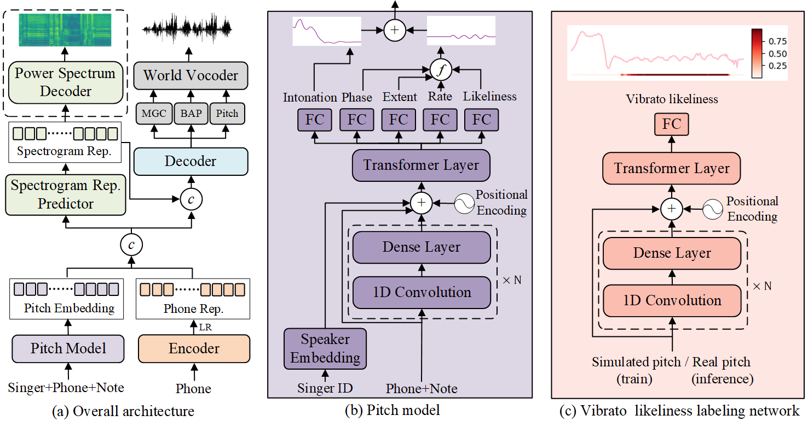

# <center>EXPRESSIVESING: SINGING VOICE SYNTHESIS WITH VIBRATO MODELING AND LATENT SPECTROGRAM REPRESENTATION</center>

<center>Yingjie Song<sup>1</sup>, Wei Song<sup>3</sup>, Wei Zhang<sup>3</sup>, Zhengchen Zhang<sup>3</sup>, Youzheng Wu<sup>3</sup>, <br> Dan Zeng<sup>1</sup>, Zhi Liu<sup>1</sup>, Yang Yu<sup>4</sup>, Xiaoping Zhang<sup>1,2</sup> <br><br></center>

<center><sup>1</sup> School of Communication and Information Engineering, Shanghai University, China<br>  
<sup>2</sup> Ryerson University, Toronto, Canada<br>
<sup>3</sup> JD AI Research, Beijing, China<br>
<sup>4</sup> Shanghai Conservatory Of Music, China</center>


## Abstract


 <div style="text-align: justify">This paper proposes an expressive singing voice synthesis system by introducing explicit vibrato modeling and latent spectrogram
representation. Vibrato is essential to the naturalness of synthesized sound, due to the inherent characteristics of human singing. Hence, a deep learning based vibrato model is introduced in this paper to control the vibrato’s likeliness, rate, extent, phase in singing. In particular, the vibrato likeliness is proposed to control if vibrato should
be added to a music note, which would help improve the singing voice naturalness. Since the vibrato likeliness label is hard to be extracted accurately from training data, a novel vibrato likeliness labeling method is proposed, and the simulated data is used to train the vibrato likeliness labeling network. Meanwhile, the power spectrogram of audio contains rich information that can improve the expressiveness of singing. An auto-encoder based latent spectrogram bottleneck feature is proposed for expressive singing voice synthesis. Experimental results on the open dataset NUS48E show that both the vibrato modeling and the latent power spectrogram representation could significantly improve the expressiveness of singing voice. The audio samples are shown in the demo website.</div>
 
 <br>



 <br>

可以这样插入链接

[点我](https://mango321321.github.io/ExpressiveSing/)
  
## 结论


1. 这样添加序号
2. 这样添加序号
3. 这样添加序号

* 这样添加无序的点
* 这样添加无序的点
* 这样添加无序的点

1. 还可以这样
  * 还可以这样
  * 还可以这样
  * 还可以这样
2. 还可以这样
  * 还可以这样
  * 还可以这样
  * 还可以这样

> 可以这样添加区块
> > 还可以嵌套
> 1. 或者增加序号

```python
print("可以这样添加代码")
```

* 也可以增加表格，用竖线隔开

| 左对齐 | 右对齐 | 居中对齐 |
| :-----| ----: | :----: |
| 单元格 | 单元格 | 单元格 |
| 单元格 | 单元格 | 单元格 |
  
## 效果展示

* 可以插入html语句实现更复杂的效果

<br>

<table align="center">
  <thead>
    <tr>
      <th>列名1</th>
      <th>列名2</th>
      <th>列名3</th>
    </tr>
  </thead>

  <tbody>
    <tr>
      <td><audio controls="" preload="auto">
            <source src="audio/ADIZ_01_7.wav"></audio></td>
      <td><audio controls="" preload="auto">
            <source src="audio/ADIZ_01_8.wav"></audio></td>
      <td><audio controls="" preload="auto">
            <source src="audio/ADIZ_09_2.wav"></audio></td>
    </tr>
  </tbody>

  <tbody>
    <tr>
      <td><audio controls="" preload="auto">
            <source src="audio/JLEE_08_12.wav"></audio></td>
      <td><audio controls="" preload="auto">
            <source src="audio/JLEE_08_13.wav"></audio></td>
      <td><audio controls="" preload="auto">
            <source src="audio/JLEE_08_4.wav"></audio></td>
    </tr>
  </tbody>

  <tbody>
    <tr>
      <td><audio controls="" preload="auto">
            <source src="audio/JTAN_15_11.wav"></audio></td>
      <td><audio controls="" preload="auto">
            <source src="audio/JTAN_20_2.wav"></audio></td>
      <td><audio controls="" preload="auto">
            <source src="audio/JTAN_20_7.wav"></audio></td>
    </tr>
  </tbody>

</table>
