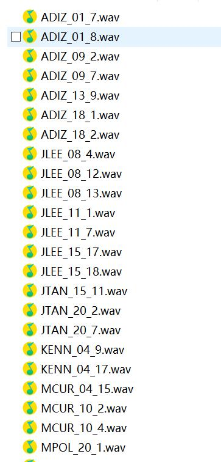

<center>这里放作者A、作者B、作者C</center>

<center>这里放单位A、单位B</center>

## 摘要

 <div style="text-align: justify">可以在这里巴巴的打字、可以在这里巴巴的打字、可以在这里巴巴的打字、可以在这里巴巴的打字、可以在这里巴巴的打字、可以在这里巴巴的打字、可以在这里巴巴的打字、可以在这里巴巴的打字、可以在这里巴巴的打字、可以在这里巴巴的打字、可以在这里巴巴的打字、可以在这里巴巴的打字、可以在这里巴巴的打字、可以在这里巴巴的打字、可以在这里巴巴的打字、可以在这里巴巴的打字</div>
 
 <br>

这里可以放一张图片



 <br>

可以这样插入链接

[点我](https://mango321321.github.io/ExpressiveSing/)
  
## 结论

1. 这样添加序号
2. 这样添加序号
3. 这样添加序号

* 这样添加无序的点
* 这样添加无序的点
* 这样添加无序的点

1. 还可以这样
  * 还可以这样
  * 还可以这样
  * 还可以这样
2. 还可以这样
  * 还可以这样
  * 还可以这样
  * 还可以这样

> 可以这样添加区块
> > 还可以嵌套
> 1. 或者增加序号

```python
print("可以这样添加代码")
```

* 也可以增加表格，用竖线隔开

| 左对齐 | 右对齐 | 居中对齐 |
| :-----| ----: | :----: |
| 单元格 | 单元格 | 单元格 |
| 单元格 | 单元格 | 单元格 |
  
## 效果展示
* 可以插入html语句实现更复杂的效果

<br>

<table align="center">
  <thead>
    <tr>
      <th>列名1</th>
      <th>列名2</th>
      <th>列名3</th>
    </tr>
  </thead>

  <tbody>
    <tr>
      <td><audio controls="" preload="auto">
            <source src="audio/ADIZ_01_7.wav"></audio></td>
      <td><audio controls="" preload="auto">
            <source src="audio/ADIZ_01_8.wav"></audio></td>
      <td><audio controls="" preload="auto">
            <source src="audio/ADIZ_09_2.wav"></audio></td>
    </tr>
  </tbody>

  <tbody>
    <tr>
      <td><audio controls="" preload="auto">
            <source src="audio/JLEE_08_12.wav"></audio></td>
      <td><audio controls="" preload="auto">
            <source src="audio/JLEE_08_13.wav"></audio></td>
      <td><audio controls="" preload="auto">
            <source src="audio/JLEE_08_4.wav"></audio></td>
    </tr>
  </tbody>

  <tbody>
    <tr>
      <td><audio controls="" preload="auto">
            <source src="audio/JTAN_15_11.wav"></audio></td>
      <td><audio controls="" preload="auto">
            <source src="audio/JTAN_20_2.wav"></audio></td>
      <td><audio controls="" preload="auto">
            <source src="audio/JTAN_20_7.wav"></audio></td>
    </tr>
  </tbody>

</table>
