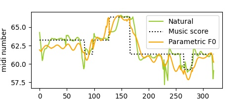

# 
EXPRESSIVESING: SINGING VOICE SYNTHESIS WITH VIBRATO MODELING AND LATENT SPECTROGRAM REPRESENTATION

<!-- 
Yingjie Song1, Wei Song3, Wei Zhang3, Zhengchen Zhang3, Youzheng Wu3,   Dan Zeng1, Zhi Liu1, Yang Yu4, Xiaoping Zhang1,2   

1 School of Communication and Information Engineering, Shanghai University, China   
2 Ryerson University, Toronto, Canada 
3 JD AI Research, Beijing, China 
4 Shanghai Conservatory of Music, China
  -->

 

- [Abstract](#abstract)
- [Overall Performance](#overall-performance)
    + [Samples of Different Systems](#samples-of-different-systems)
    + [Additional experiment](#additional-experiment)
- [Ablation Study](#ablation-study)
    + [ES-V vs ES](#es-v-vs-es)
    + [ES-E1 vs ES](#es-e1-vs-es)
    + [Examples of Different Pitch Models](#examples-of-different-pitch-models)
- [Details of Vibrato Likeliness Labeling Model](#details-of-vibrato-likeliness-labeling-model)

## Abstract
-----------

 
This paper proposes an expressive singing voice synthesis system by introducing explicit vibrato modeling and latent spectrogram
representation. Vibrato is essential to the naturalness of synthesized sound, due to the inherent characteristics of human singing. Hence, a deep learning based vibrato model is introduced in this paper to control the vibrato’s likeliness, rate, extent, phase in singing. In particular, the vibrato likeliness is proposed to control if vibrato should
be added to a music note, which would help improve the singing voice naturalness. Since the vibrato likeliness label is hard to be extracted accurately from training data, a novel vibrato likeliness labeling method is proposed, and the simulated data is used to train the vibrato likeliness labeling network. Meanwhile, the power spectrogram of audio contains rich information that can improve the expressiveness of singing. An auto-encoder based latent spectrogram bottleneck feature is proposed for expressive singing voice synthesis. Experimental results on the open dataset NUS48E show that both the vibrato modeling and the latent power spectrogram representation could significantly improve the expressiveness of singing voice. The audio samples are shown in the demo website.

 

## Overall Performance
-----------

#### Samples of Different Systems

 

<table align="center">
  <thead>
    <tr>
      <th>/</th>
      <th>Sample 1</th>
      <th>Sample 2</th>
      <th>Sample 3</th>
      <th>Sample 4</th>
    </tr>
  </thead>

  <tbody>
    <tr>
      <td><b>Baseline</b></td>
      <td><audio controls="" preload="auto">
            <source src="audio/mos_demo_web/baseline/VKOW_20_JLEE_1.wav"></audio></td>
      <td><audio controls="" preload="auto">
            <source src="audio/mos_demo_web/baseline/VKOW_20_JLEE_2.wav"></audio></td>
      <td><audio controls="" preload="auto">
            <source src="audio/mos_demo_web/baseline/VKOW_20_JTAN_1.wav"></audio></td>
      <td><audio controls="" preload="auto">
            <source src="audio/mos_demo_web/baseline/VKOW_20_JTAN_2.wav"></audio></td>
    </tr>
  </tbody>

  <tbody>
    <tr>
     <td><b>USVC</b> </td>
       <td><audio controls="" preload="auto">
            <source src="audio/mos_demo_web/USVC/VKOW_20_JLEE_1.wav"></audio></td>
      <td><audio controls="" preload="auto">
            <source src="audio/mos_demo_web/USVC/VKOW_20_JLEE_2.wav"></audio></td>
      <td><audio controls="" preload="auto">
            <source src="audio/mos_demo_web/USVC/VKOW_20_JTAN_1.wav"></audio></td>
      <td><audio controls="" preload="auto">
            <source src="audio/mos_demo_web/USVC/VKOW_20_JTAN_2.wav"></audio></td>
    </tr>
  </tbody>

  <tbody>
    <tr>
     <td><b>WGANSing</b> </td>
      <td><audio controls="" preload="auto">
            <source src="audio/mos_demo_web/WGANSing/VKOW_20_JLEE_1.wav"></audio></td>
      <td><audio controls="" preload="auto">
            <source src="audio/mos_demo_web/WGANSing/VKOW_20_JLEE_2.wav"></audio></td>
      <td><audio controls="" preload="auto">
            <source src="audio/mos_demo_web/WGANSing/VKOW_20_JTAN_1.wav"></audio></td>
      <td><audio controls="" preload="auto">
            <source src="audio/mos_demo_web/WGANSing/VKOW_20_JTAN_2.wav"></audio></td>
    </tr>
   </tbody>
   
   <tbody>
    <tr>
     <td><b>UCSVC</b> </td>
       <td><audio controls="" preload="auto">
            <source src="audio/mos_demo_web/UCSVC/VKOW_20_JLEE_1.wav"></audio></td>
      <td><audio controls="" preload="auto">
            <source src="audio/mos_demo_web/UCSVC/VKOW_20_JLEE_2.wav"></audio></td>
      <td><audio controls="" preload="auto">
            <source src="audio/mos_demo_web/UCSVC/VKOW_20_JTAN_1.wav"></audio></td>
      <td><audio controls="" preload="auto">
            <source src="audio/mos_demo_web/UCSVC/VKOW_20_JTAN_2.wav"></audio></td>
    </tr>
  </tbody>
 
 <tbody>
    <tr>
     <td><b>ExpressiveSing</b> </td>
      <td><audio controls="" preload="auto">
            <source src="audio/mos_demo_web/ours/VKOW_20_JLEE_1.wav"></audio></td>
      <td><audio controls="" preload="auto">
            <source src="audio/mos_demo_web/ours/VKOW_20_JLEE_2.wav"></audio></td>
      <td><audio controls="" preload="auto">
            <source src="audio/mos_demo_web/ours/VKOW_20_JTAN_1.wav"></audio></td>
      <td><audio controls="" preload="auto">
            <source src="audio/mos_demo_web/ours/VKOW_20_JTAN_2.wav"></audio></td>
    </tr>
   </tbody>
</table>

P.S. 1)<b>USVC</b>, the audios from this <a href="https://enk100.github.io/Unsupervised_Singing_Voice_Conversion/">link</a>; 
     2)<b>WGANSing</b>, where we retrain the model on the same training set as ExpressiveSing. The original web is <a href="https://pc2752.github.io/sing_synth_examples/">here</a>; 
     3)<b>UCSVC</b>, the audios from this <a href="https://singing-conversion.github.io/">link</a>.

 

#### Additional Experiment
<table align="center">
  <thead>
    <tr>
      <th>/</th>
      <th>Sample 1</th>
      <th>Sample 2</th>
      <th>Sample 3</th>
      <th>Sample 4</th>
    </tr>
  </thead>

  <tbody>
    <tr>
      <td><b>Fastspeech2</b></td>
      <td><audio controls="" preload="auto">
            <source src="audio/ADIZ_01_7.wav"></audio></td>
      <td><audio controls="" preload="auto">
            <source src="audio/ADIZ_01_8.wav"></audio></td>
      <td><audio controls="" preload="auto">
            <source src="audio/ADIZ_09_2.wav"></audio></td>
      <td><audio controls="" preload="auto">
            <source src="audio/ADIZ_09_2.wav"></audio></td>
    </tr>
  </tbody>

  <tbody>
    <tr>
      <td><b>ExpressiveSing</b></td>
      <td><audio controls="" preload="auto">
            <source src="audio/ADIZ_01_7.wav"></audio></td>
      <td><audio controls="" preload="auto">
            <source src="audio/ADIZ_01_8.wav"></audio></td>
      <td><audio controls="" preload="auto">
            <source src="audio/ADIZ_09_2.wav"></audio></td>
      <td><audio controls="" preload="auto">
            <source src="audio/ADIZ_09_2.wav"></audio></td>
    </tr>
  </tbody>
</table>
 

##  Ablation Study
-----------

#### ES-V vs ES
<table align="center">
  <thead>
    <tr>
      <th>/</th>
      <th>Sample 1</th>
      <th>Sample 2</th>
      <th>Sample 3</th>
      <th>Sample 4</th>
      <th>Sample 5</th>
      <th>Sample 6</th>
      <th>Sample 7</th>
    </tr>
  </thead>

  <tbody>
    <tr>
      <td nowrap="nowrap"><b>ES-V</b></td>
      <td><audio controls="" preload="auto">
            <source src="audio/abtest/pitch/output_whole_vibrato/ADIZ_01_7_output.wav"></audio></td>
      <td><audio controls="" preload="auto">
            <source src="audio/abtest/pitch/output_whole_vibrato/ADIZ_09_2_output.wav"></audio></td>
      <td><audio controls="" preload="auto">
            <source src="audio/abtest/pitch/output_whole_vibrato/ADIZ_18_1_output.wav"></audio></td>
      <td><audio controls="" preload="auto">
            <source src="audio/abtest/pitch/output_whole_vibrato/JLEE_08_12_output.wav"></audio></td>
     <td><audio controls="" preload="auto">
            <source src="audio/abtest/pitch/output_whole_vibrato/PMAR_11_11_output.wav"></audio></td>
      <td><audio controls="" preload="auto">
            <source src="audio/abtest/pitch/output_whole_vibrato/PMAR_15_6_output.wav"></audio></td>
      <td><audio controls="" preload="auto">
            <source src="audio/abtest/pitch/output_whole_vibrato/VKOW_20_2_output.wav"></audio></td>
    </tr>
  </tbody>
 
  <tbody>
    <tr>
      <td><b>ES</b></td>
      <td><audio controls="" preload="auto">
            <source src="audio/abtest/pitch/output_our_pitch/ADIZ_01_7_output.wav"></audio></td>
      <td><audio controls="" preload="auto">
            <source src="audio/abtest/pitch/output_our_pitch/ADIZ_09_2_output.wav"></audio></td>
      <td><audio controls="" preload="auto">
            <source src="audio/abtest/pitch/output_our_pitch/ADIZ_18_1_output.wav"></audio></td>
      <td><audio controls="" preload="auto">
            <source src="audio/abtest/pitch/output_our_pitch/JLEE_08_12_output.wav"></audio></td>
     <td><audio controls="" preload="auto">
            <source src="audio/abtest/pitch/output_our_pitch/PMAR_11_11_output.wav"></audio></td>
      <td><audio controls="" preload="auto">
            <source src="audio/abtest/pitch/output_our_pitch/PMAR_15_6_output.wav"></audio></td>
      <td><audio controls="" preload="auto">
            <source src="audio/abtest/pitch/output_our_pitch/VKOW_20_2_output.wav"></audio></td>
    </tr>
  </tbody>

 
</table>
 

#### ES-E1 vs ES 
<table align="center">
  <thead>
    <tr>
      <th>/</th>
      <th>Sample 1</th>
      <th>Sample 2</th>
      <th>Sample 3</th>
      <th>Sample 4</th>
      <th>Sample 5</th>
      <th>Sample 6</th>
      <th>Sample 7</th>
    </tr>
  </thead>

  <tbody>
    <tr>
      <td nowrap="nowrap"><b>ES-E1</b></td>
         <td><audio controls="" preload="auto">
            <source src="audio/abtest/energy/Dian_1d_energy/ADIZ_09_7_output.wav"></audio></td>
      <td><audio controls="" preload="auto">
            <source src="audio/abtest/energy/Dian_1d_energy/MCUR_10_2_output.wav"></audio></td>
      <td><audio controls="" preload="auto">
            <source src="audio/abtest/energy/Dian_1d_energy/MCUR_10_4_output.wav"></audio></td>
      <td><audio controls="" preload="auto">
            <source src="audio/abtest/energy/Dian_1d_energy/MPUR_03_3_output.wav"></audio></td>
      <td><audio controls="" preload="auto">
            <source src="audio/abtest/energy/Dian_1d_energy/PMAR_15_12_output.wav"></audio></td>
      <td><audio controls="" preload="auto">
            <source src="audio/abtest/energy/Dian_1d_energy/VKOW_11_14_output.wav"></audio></td>
      <td><audio controls="" preload="auto">
            <source src="audio/abtest/energy/Dian_1d_energy/ZHIY_02_8_output.wav"></audio></td>
    </tr>
  </tbody>
 
  <tbody>
    <tr>
      <td nowrap="nowrap"><b>ES</b></td>
      <td><audio controls="" preload="auto">
            <source src="audio/abtest/energy/Dian_energy_multitask/ADIZ_09_7_output.wav"></audio></td>
      <td><audio controls="" preload="auto">
            <source src="audio/abtest/energy/Dian_energy_multitask/MCUR_10_2_output.wav"></audio></td>
      <td><audio controls="" preload="auto">
            <source src="audio/abtest/energy/Dian_energy_multitask/MCUR_10_4_output.wav"></audio></td>
      <td><audio controls="" preload="auto">
            <source src="audio/abtest/energy/Dian_energy_multitask/MPUR_03_3_output.wav"></audio></td>
      <td><audio controls="" preload="auto">
            <source src="audio/abtest/energy/Dian_energy_multitask/PMAR_15_12_output.wav"></audio></td>
      <td><audio controls="" preload="auto">
            <source src="audio/abtest/energy/Dian_energy_multitask/VKOW_11_14_output.wav"></audio></td>
      <td><audio controls="" preload="auto">
            <source src="audio/abtest/energy/Dian_energy_multitask/ZHIY_02_8_output.wav"></audio></td>
    </tr>
  </tbody>

</table>

 

#### Examples of Different Pitch Models 

<table><thead>
<tr>
<th style="text-align: center"> / </th>
<th style="text-align: center">Sample 1</th>
<th style="text-align: center">Sample 2</th>
<th style="text-align: center">Sample 3</th>
</tr></thead><tbody>
<tr>
<td nowrap="nowrap"><b>Parametric F0</b></td>
<td><audio controls="controls" ><source src="./audio/pitch_show_audio/output_Parametric_F0/ADIZ_01_7_output.wav" autoplay/>Your browser does not support the audio element.</audio>  

 </td>
<td><audio controls="controls" ><source src="./audio/pitch_show_audio/output_Parametric_F0/ADIZ_18_1_output.wav" autoplay/>Your browser does not support the audio element.</audio>  

 </td>
<td><audio controls="controls" ><source src="./audio/pitch_show_audio/output_Parametric_F0/PMAR_15_6_output_web.wav" autoplay/>Your browser does not support the audio element.</audio>

 </td>
</tr>
    
<tr>
<td nowrap="nowrap"><b>ES-V</b></td>
<td><audio controls="controls" ><source src="../audio/deepsinger/zh/0K2P2e1dc_5_raw.wav" autoplay/>Your browser does not support the audio element.</audio>
      

 </td>
<td><audio controls="controls" ><source src="../audio/deepsinger/zh/0K2P2e1dc_15_raw.wav" autoplay/>Your browser does not support the audio element.</audio>  </td>
<td><audio controls="controls" ><source src="../audio/deepsinger/zh/XIKddfe0_37_raw.wav" autoplay/>Your browser does not support the audio element.</audio></td>
</tr>
 
<tr>
<td nowrap="nowrap"><b>ES</b></td>
<td><audio controls="controls" ><source src="../audio/deepsinger/zh/0K2P2e1dc_5_raw.wav" autoplay/>Your browser does not support the audio element.</audio>
      

 </td>
<td><audio controls="controls" ><source src="../audio/deepsinger/zh/0K2P2e1dc_15_raw.wav" autoplay/>Your browser does not support the audio element.</audio>  </td>
<td><audio controls="controls" ><source src="../audio/deepsinger/zh/XIKddfe0_37_raw.wav" autoplay/>Your browser does not support the audio element.</audio></td>
</tr>

</tbody></table>

 

## Details of Vibrato Likeliness Labeling Model
-----------
